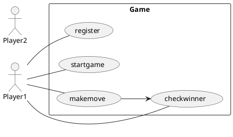
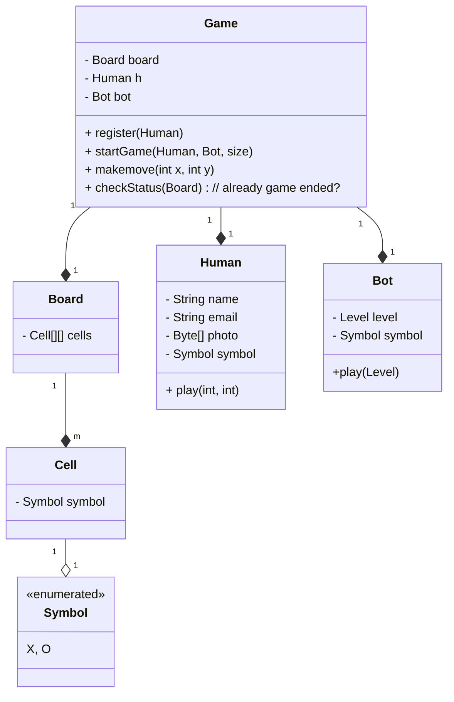
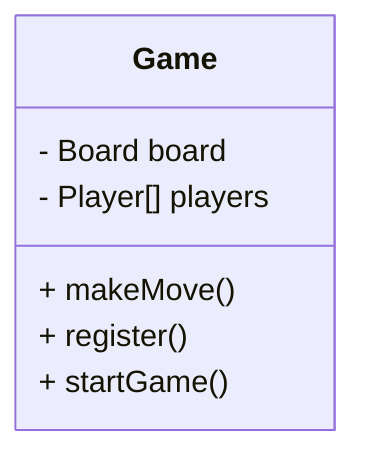
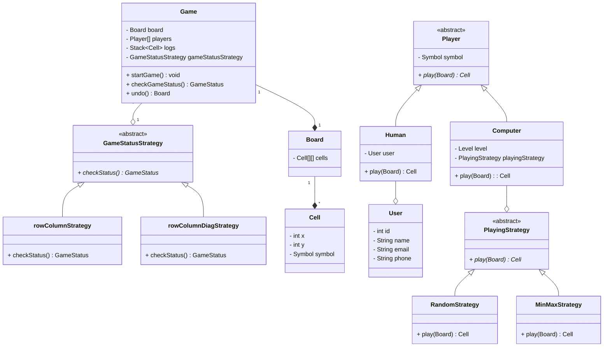

## TIC TAC TOE

- CLI APPLICATION

Steps to think

- Human can register in platform
- Human will start game
- Human will decide the size of board
- Human will decide number of players
- Human will choose his symbol from given symbol
- Bot can play
- Bot has level
- Bot will be assigned random symbol which is not used and continue to use it till end
- Board contains cells
- Cell can contain symbol(if filled)
-

One human can play many games but why 1:1?

- because the human might have different symbol in different games.

# Problems:

- Here Human canot play with human (introduce player parent abstract class )
- Much memory is needed for human instances.
- Bot play will not follow SRP and OCP.

Here we introduce

Design the game of tic-tac-toe game that is played between two players on a n x n grid. The game supports following features:

1. One or both of the two players can be computer.

2. User should be able to select a difficulty level(easy, medium, hard) while playing with a computer.

Future Scope:

1. Add undo feature to the game.

2. Rules to decide the winner can be changed.

