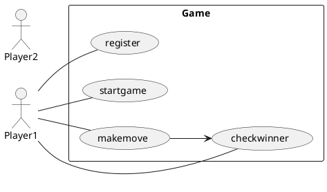
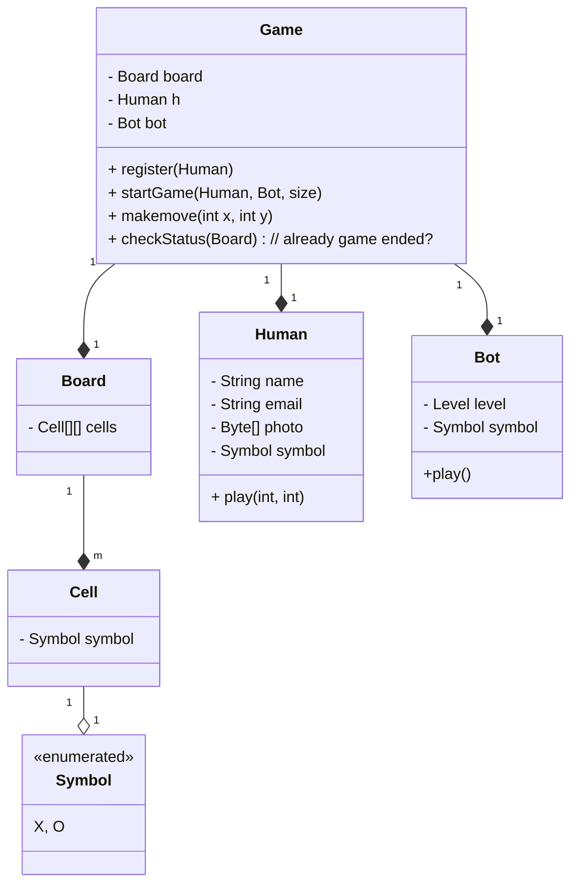

## TIC TAC TOE

- CLI APPLICATION

Steps to think

- Human can register in platform
- Human will start game
- Human will decide the size of board
- Human will decide number of players
- Human will choose his symbol from given symbol
- Bot can play
- Bot has level
- Bot will be assigned random symbol which is not used and continue to use it till end
- Board contains cells
- Cell can contain symbol(if filled)
-

One human can play many games but why 1:1?

- because the human might have different symbol in different games.
